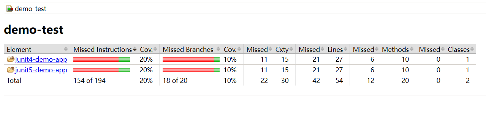

# JavaUnitTestSample
Java unit test sample with junit4 and junit5. 

# Usage

```bash
cd src
mvn test
```

then: 

```bash
cd src/demo-test/target/site/jacoco-aggregate

open index.html
```

you will see the aggregate report per module:


